## 1. Methodologies and Models Tested

These are the following plots for the methodologies tested.

Our first approach was to choose **six different classifiers** which we believed could have good performance on predicting if the shot was indeed a goal or not.  
The models we chose were the following:  
**RidgeClassifier**, **SGDClassifier**, **Random Forest**, **XGBoost**, **CatBoost**, and **MLP**.

Our first methodology was to simply do a **hyperparameter search**, so an exhaustive grid search on all possible combinations of hyperparameters which reduced the error on the validation set while increasing accuracy. All of the models had relative scores with one another, which will be shown in the following figures on which we performed the grid search.

[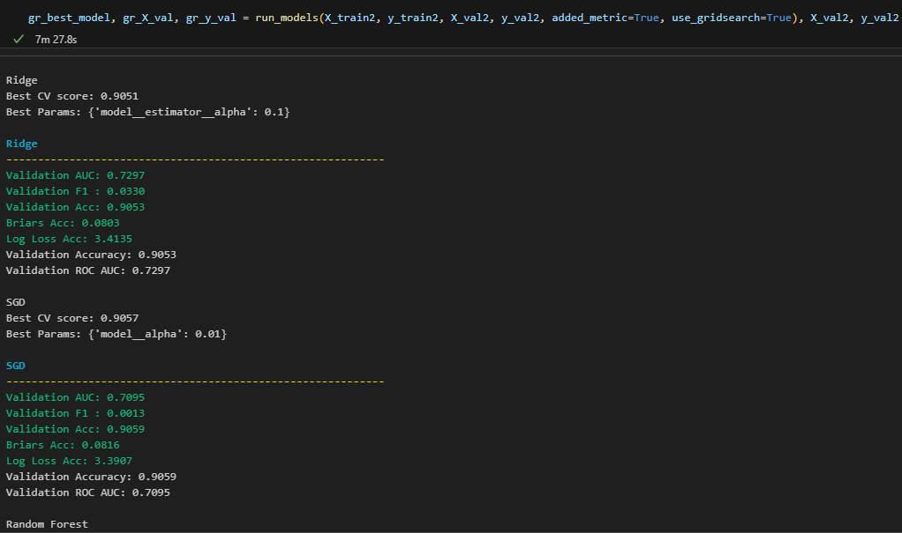](./figures/give_it_your_best_shot/figures/figure_1.png)  
[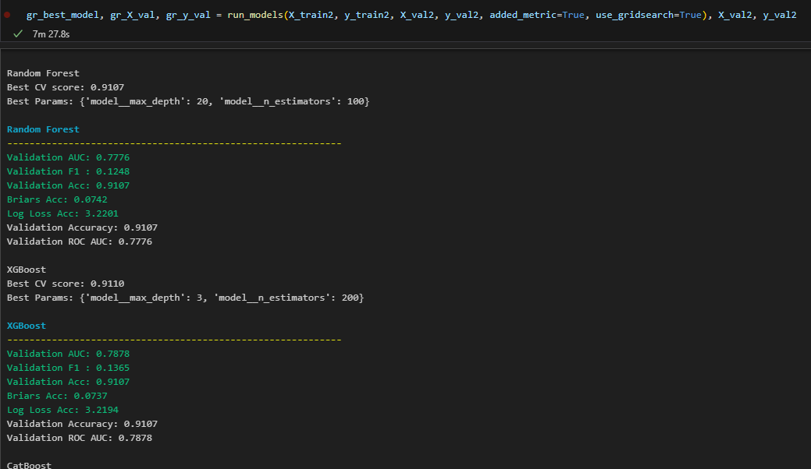](./figures/give_it_your_best_shot/figures/figure_2.png)  
[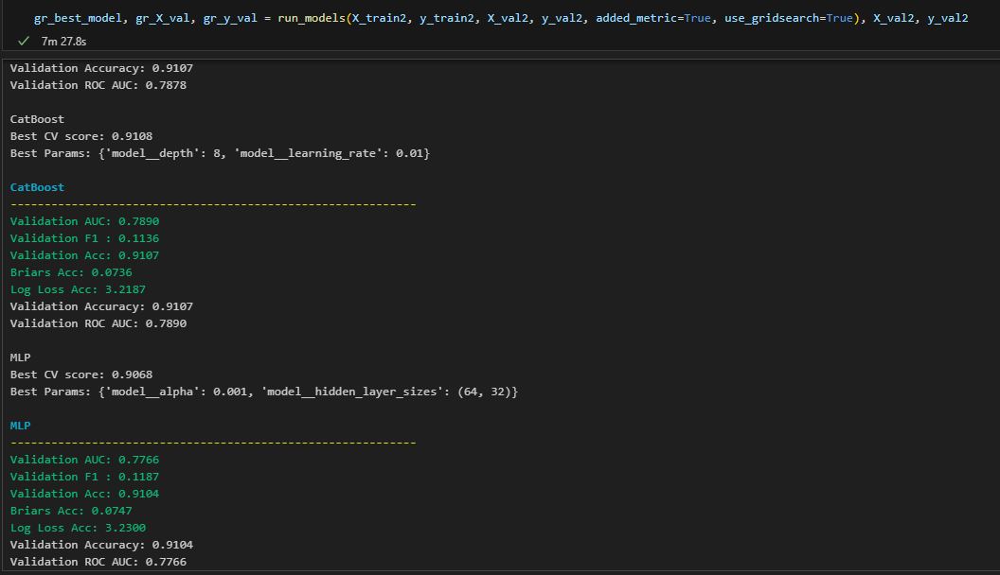](./figures/give_it_your_best_shot/figures/figure_3.png)

The best model across all the testing was the **CatBoost classifier**.

> **Notice:**  
> This pattern — where **CatBoost consistently outperformed** other models — was also observed in additional optimization tests that we conducted but did not include in this report.  
> The full details of those experiments can be reviewed in the notebook  `give_it_your_best_shot.ipynb`

After obtaining our optimized hyperparameters, we also conducted other approaches which we found to be interesting to try out different models to increase accuracy while reducing error. To determine if one model was better than another, we chose to compare the **ROC score** instead of accuracy. This is an arbitrary metric we chose, but accuracy could have been chosen if desired.

Our second approach was to try **MRMR (Minimum Redundancy Maximum Relevance)** in which we observed the most relevant features in the dataframe while removing all the ones that weren't useful. This resulted in the following graph which shows the feature relevancy according to this methodology:

[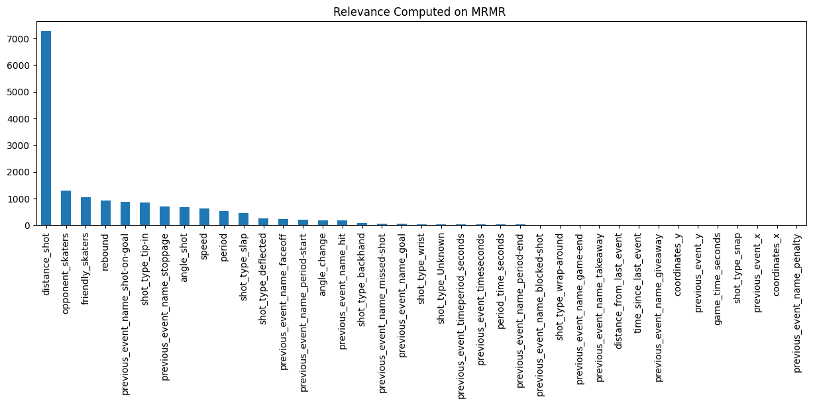](./figures/give_it_your_best_shot/figures/mrmr_feature_relevance.png)  

This kept 20 out of the 39 features and we then trained the model. This resulted in performance similar to the grid search method, and the models didn't yield any significant improvements.

Our third approach was to try a **Lasso regularization** method that we used on the training set, and we then selected the top 20 features, expanding from our last methodology. However, this also didn't yield any significant improvements or notable changes in model performance.

We also used Random Forest to find the best features in relation to the predicted value which is if the shot is a goal or not and this is the grpah we obtain showing the relevant features:

[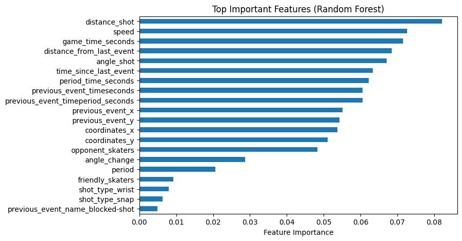](./figures/give_it_your_best_shot/figures/rf_feature_selection.png)

We then trained a model with the top 20 features selected by this Random Forest method, but this led to no notable improvements in model performance.

We continued with other methods such as trying **different splits in the test and validation sets**, and **adding new features** such as `isRush`, which computes the time between the current and last event — if this difference in time is less than 4 seconds, we mark the event as a rush.  
All these methodologies did not yield any significant differences in performance, which can be observed in the following plots and metrics for the given models.

Overall, our best model was indeed the **CatBoost classifier**, as when running it across all these different runs, CatBoost consistently came out on top in terms of performance — though it was always a close call between CatBoost and XGBoost.

---

## 2. Performance Plots and Metrics

These are the plots for the following curves for the respective methodologies which we found interesting to note:

### 2.1 Plots 
**ROC Curve (Distance + Angle)**  
[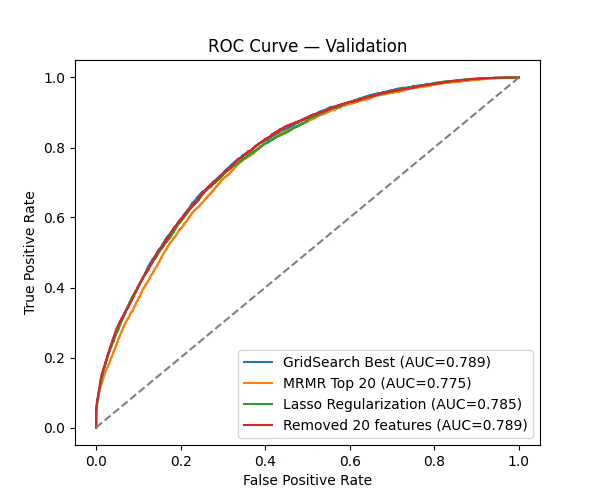](https://wandb.ai/IFT6758-2025-B1/IFT6758-2025-B01/runs/26yweo74/panel/jw48ews1m?nw=nwusergafranijaz)

**Goal Rate vs Probability Percentile**  
[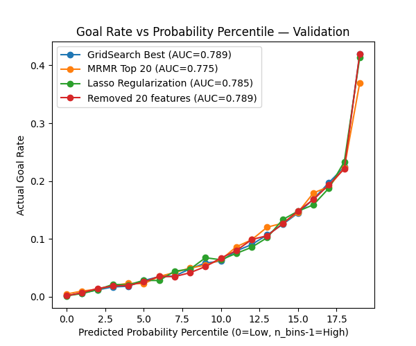](https://wandb.ai/IFT6758-2025-B1/IFT6758-2025-B01/runs/26yweo74/panel/i367l86m7?nw=nwusergafranijaz)

**Cumulative Goals vs Shots**  
[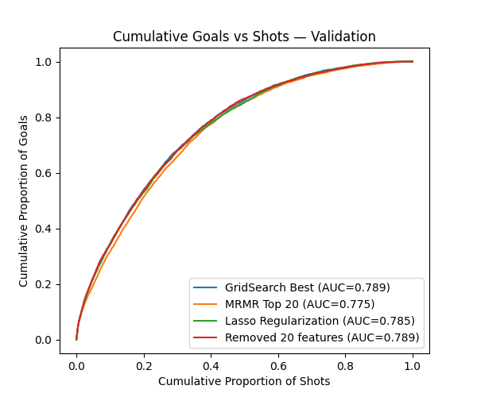](https://wandb.ai/IFT6758-2025-B1/IFT6758-2025-B01/runs/26yweo74/panel/6np7s0575?nw=nwusergafranijaz)

**Reliability Curve – Validation**  
[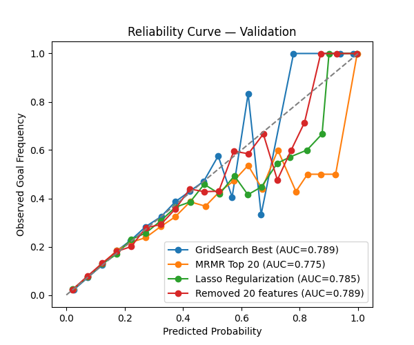](https://wandb.ai/IFT6758-2025-B1/IFT6758-2025-B01/runs/26yweo74/panel/b500ldcu6?nw=nwusergafranijaz)

### 2.2 Metrics

Below are the comparative results for the four main methodologies tested in our research.  
For each approach, we include three key evaluation plots — **ROC/AUC Curve**, **Brier Score**, and **Accuracy** — which help visualize model performance across different metrics.

---

#### **Grid Search**

**ROC / AUC Curve**  
[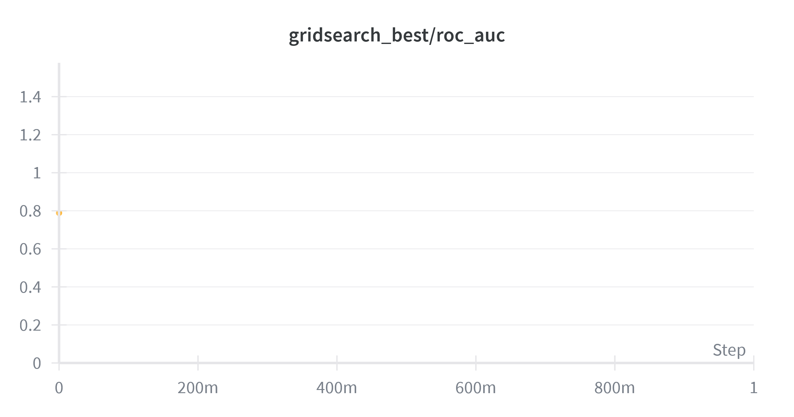](https://wandb.ai/IFT6758-2025-B1/IFT6758-2025-B01/runs/26yweo74?nw=nwusergafranijaz&panelDisplayName=gridsearch_best%2Froc_auc&panelSectionName=gridsearch_best)

**Brier Score**  

**Accuracy**  
[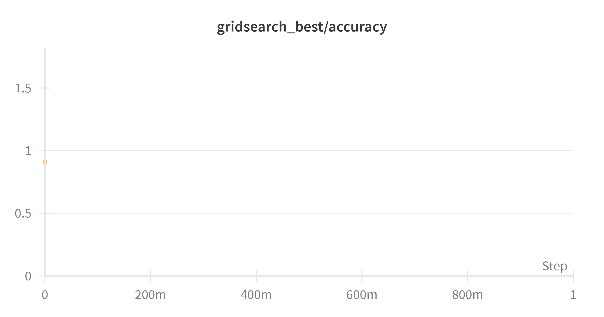](https://wandb.ai/IFT6758-2025-B1/IFT6758-2025-B01/runs/26yweo74?nw=nwusergafranijaz&panelDisplayName=gridsearch_best%2Faccuracy&panelSectionName=gridsearch_best)

---

#### **MRMR (Minimum Redundancy Maximum Relevance)**

**ROC / AUC Curve**  
[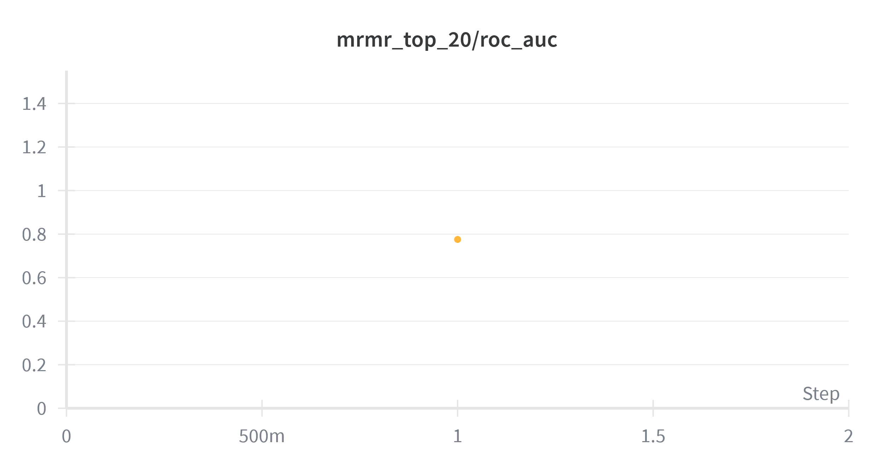](https://wandb.ai/IFT6758-2025-B1/IFT6758-2025-B01/runs/26yweo74?nw=nwusergafranijaz&panelDisplayName=mrmr_top_20%2Froc_auc&panelSectionName=mrmr_top_20)

**Brier Score**  
[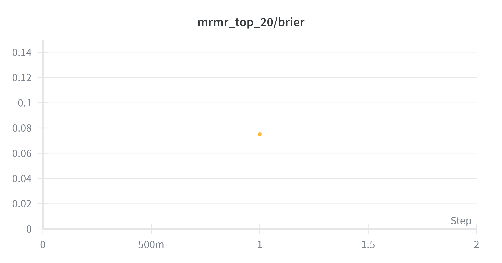](https://wandb.ai/IFT6758-2025-B1/IFT6758-2025-B01/runs/26yweo74?nw=nwusergafranijaz&panelDisplayName=mrmr_top_20%2Fbrier&panelSectionName=mrmr_top_20)

**Accuracy**  
[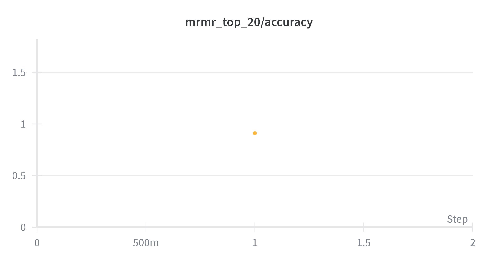](https://wandb.ai/IFT6758-2025-B1/IFT6758-2025-B01/runs/26yweo74?nw=nwusergafranijaz&panelDisplayName=mrmr_top_20%2Faccuracy&panelSectionName=mrmr_top_20)

---

#### **Lasso Regularization**

**ROC / AUC Curve**  
[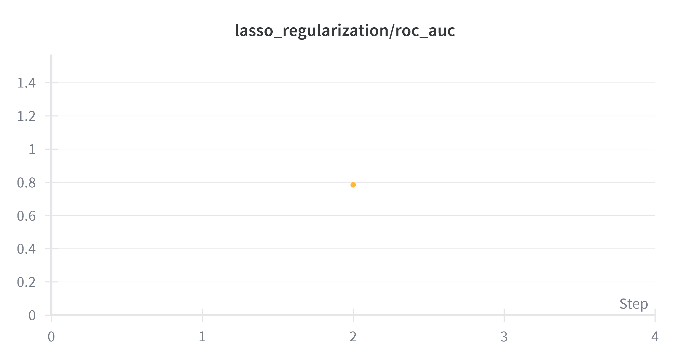](https://wandb.ai/IFT6758-2025-B1/IFT6758-2025-B01/runs/26yweo74?nw=nwusergafranijaz&panelDisplayName=lasso_regularization%2Froc_auc&panelSectionName=lasso_regularization)

**Brier Score**  
[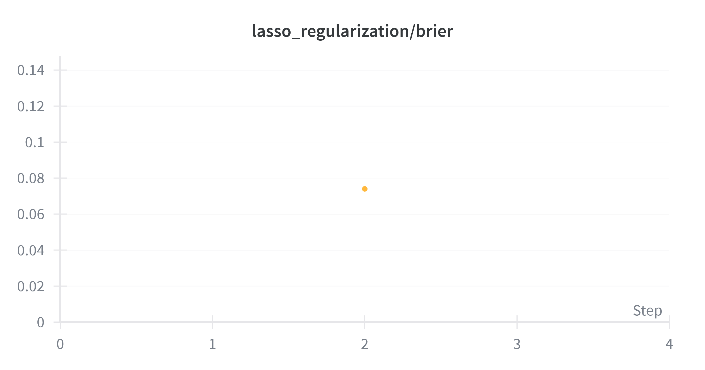](https://wandb.ai/IFT6758-2025-B1/IFT6758-2025-B01/runs/26yweo74?nw=nwusergafranijaz&panelDisplayName=lasso_regularization%2Fbrier&panelSectionName=lasso_regularization)

**Accuracy**  

---

#### **Split with 20 Features Removed**

**ROC / AUC Curve**  
[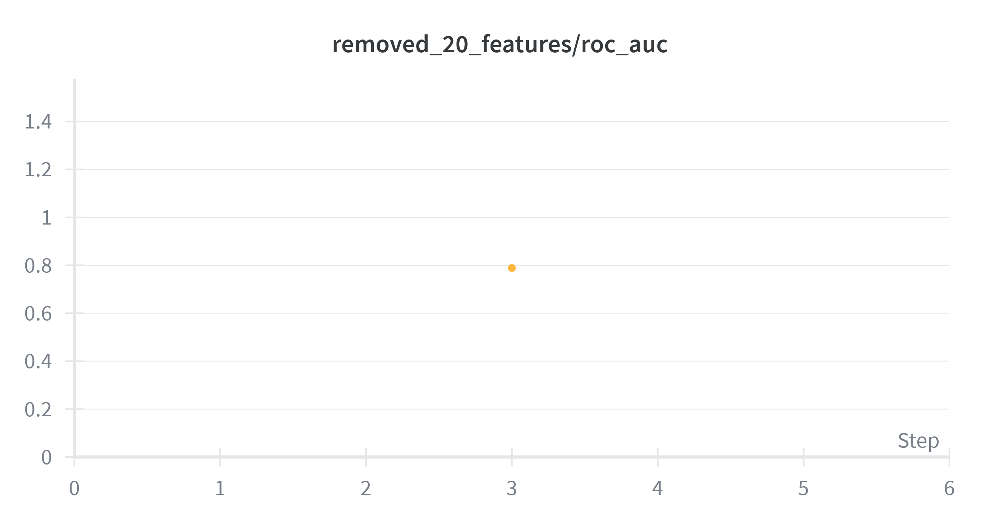](https://wandb.ai/IFT6758-2025-B1/IFT6758-2025-B01/runs/26yweo74?nw=nwusergafranijaz&panelDisplayName=removed_20_features%2Froc_auc&panelSectionName=removed_20_features)

**Brier Score**  
[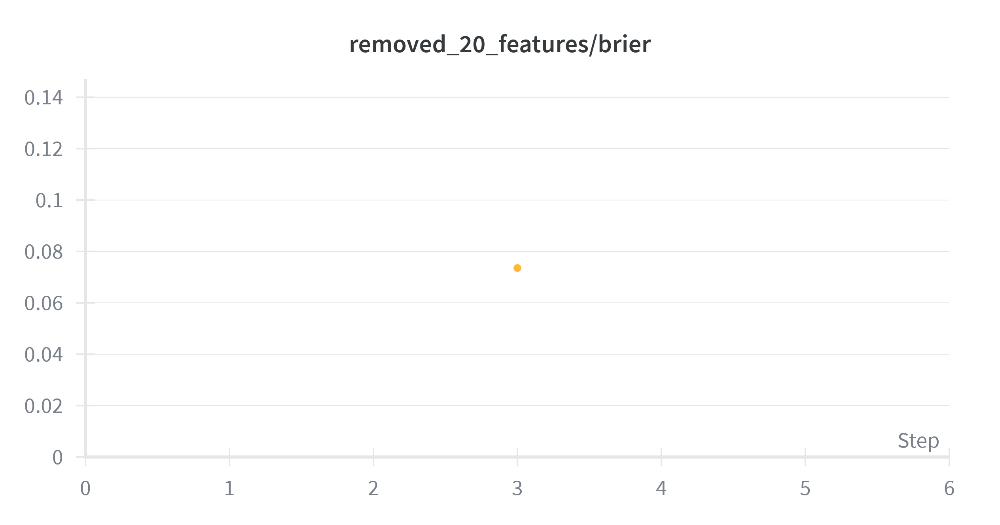](https://wandb.ai/IFT6758-2025-B1/IFT6758-2025-B01/runs/26yweo74?nw=nwusergafranijaz&panelDisplayName=removed_20_features%2Fbrier&panelSectionName=removed_20_features)

**Accuracy**  
[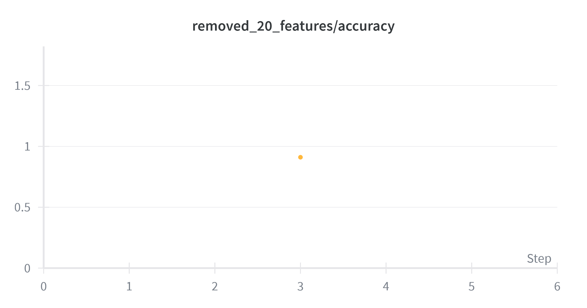](https://wandb.ai/IFT6758-2025-B1/IFT6758-2025-B01/runs/26yweo74?nw=nwusergafranijaz&panelDisplayName=removed_20_features%2Faccuracy&panelSectionName=removed_20_features)

---

These are the scores for the respective methods we tried.  
*Important to note that all these models are using **CatBoost**, and not any of the other five models mentioned beforehand.*

### 2.3 W&B Runs and Model References

Below are the **Weights & Biases (W&B)** run links that were used to generate the plots and metrics displayed above.  
Each run corresponds to a specific methodology or model configuration evaluated in our research.

---

#### **Grid Search**
🔗 [View Run on W&B](https://wandb.ai/IFT6758-2025-B1/IFT6758-2025-B01/artifacts/model/gridsearch_best/v3)

#### **MRMR (Minimum Redundancy Maximum Relevance)**
🔗 [View Run on W&B](https://wandb.ai/IFT6758-2025-B1/IFT6758-2025-B01/artifacts/model/mrmr_top_20/v3)

#### **Lasso Regularization**
🔗 [View Run on W&B](https://wandb.ai/IFT6758-2025-B1/IFT6758-2025-B01/artifacts/model/lasso_regularization/v3)

#### **Split with 20 Features Removed**
🔗 [View Run on W&B](https://wandb.ai/IFT6758-2025-B1/IFT6758-2025-B01/artifacts/model/removed_20_features/v3)

---

*Each of the above runs contains detailed logs, metrics, and visualizations used in generating the figures for Sections 2.1 and 2.2.*

